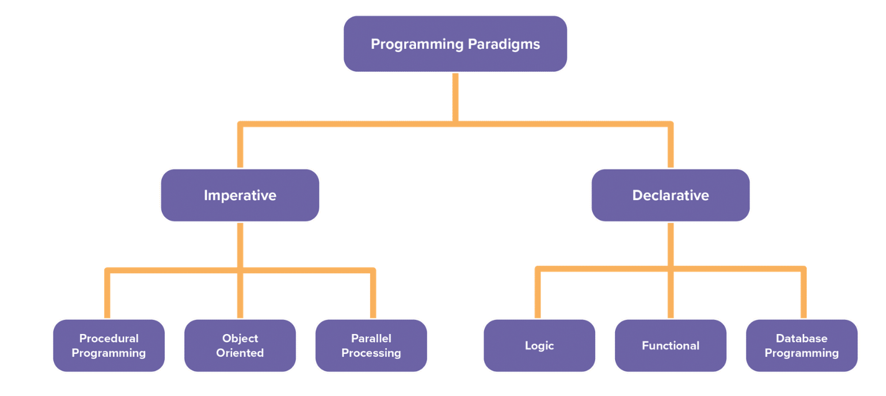

# Git Commands
* git init => creates a git repo in the selected folder
* git add . => add all files in the folder to be tracked
* git status => check status of staging files  
* git commit -m "your commit message" => commit code
* git checkout -b nameOfBranch => to jump to branch x
* git branch => to see the active branch
* git remote add origin http://github.com/etc => adds the remote repo
* git push -u origin master => pushes to the remote called origin and to the branch master
* git revert <\hashcode of the commit> => reverts the identified commit.
* git pull or git pull origin master => to  
* git log => allows us to see all new commits 

TODO: KATAS Create a test repo, add files, commit them, create a feature branch with other file, commit them, and then create a pull request in git, and then merge both branches and delete the outstanding branch.

# Conda

Creating environments
    
    conda create -n <env-name>

    //and to add packages
    conda create -n myEnvironment python numpy pandas

Listing environments

    conda info --envs

Change active environment back to default

    conda activate

Install packages

    conda install matplotlib

# Programming paradigms

Imperative - describes steps that change the state of the computer (like a cooking recipe)

1) Sequence of statements
2) Order dependency
3) Statements hold state
4) Immutable and mutable variables
5) Statements can have side effects

## Object Oriented

1) Main interest is on the data rather than procedure
2) Functions that operate on related data are kept in a single data structure (object)
3) Data is hidden (information hiding) from functions outside the object.
4) Communication between objects is by functions (message passing) 

Declarative - describes "what" a program should accomplish without describing exactly how to achieve it.

## Logic 

1) Programs written in sentences which are in a logic form
2) Sentences have facts and rules about a problem
3) Computing takes place over the sentences, and their component. This is known as a "universal" alphabet
4) Values are assigned to variables by means of automatically generated substitutions
5) The control is provided by a single mechanism (Automatic backtracking)
6) Can have an inference engine

## Functional
Its a tree of functions that project values to other values.(Ex: Expression trees)
Functions are Immutable and will return the same values for the same arguments.
There are no global variables so there are no side effects.

1) State does not exist, all data is Immutable data.
2) Order of execution is not important
3) A program is made up of functions and data structures
4) Lazy evaluation
5) No loops (instead use recursion)

# Requirements

## Functional Requirements (Task)
Describes tasks that have to be undertaken to construct a system. Ex: a search function that takes an invoice number as an argument and returns details of an invoice that matches the invoice number.

Best practices:

1) A single requirement must explain a single task.
2) Must be complete as possible. They must not be vague or rely upon unwritten domain knowledge
3) Document must be complete as possible. No assumptions can be made that the reader will infer that extra tasks are required.
4) All requirements must have an equivalent objective or principal to produce a working system.
5) Provide a unique code for each requirement so that they can be tracked through the project development
6) Reconcile the requirements so that they are logically consistent.

## Non-Functional Requirements (Constraints)
Specify a criteria that can be used to judge the operation of a system, rather than specific behaviors. They're typically system behaviours such as: Performance; Scaleability; and Availability.
They're constraints on the design of the system

## User Stories
A user story is an informal, natural language description of one or more features of a software system, often written from the perspective of an end user or user of a system.

## Requirements Elicitation

Describe the solution to be developed, including its functions, interfaces, design, and user experience. They’re usually formulated by the client or stakeholders.

Requirements elicitation is a complex process that consists of gathering, researching, defining, structuring, and clarifying a product’s requirements. It is an important step of the discovery phase of a project.

There are four types of requirements BAs usually handle during requirement elicitation:

1) Business requirements describe why a project is needed and how the company will benefit from it.
2) Stakeholder requirements capture the needs and expectations of stakeholders.
3) Solution requirements contain technical demands. They can be functional (describing what the system should do) and non-functional (describing the qualities the system should have).
4) Transition requirements define actions to be taken to transfer an organization from its current state to the desired state.

Key benefits:

* Establishes the precise scope of work and the budget.
* Avoids confusion during development. 
* Adds business value.
* Reveals hidden and assumed requirements.
* Allows for developing only relevant functionality

1) Preparing for elicitation - Collecting documentation needed and analyzing the current system (if exists). It usually includes:
* a description of the organization: business rules, structure, legal and regulatory requirements
* details of the project: solution analysis results, reports, or requirements prepared by other business analysts, technical and end user documentation of the existing system, manuals, instructions, tutorials for users and employees
* marketing materials: market research, competitor analysis, materials used to promote the solution

To speed up the study, the ba usually ask the client to provide a SME.

Analyzing stakeholder roles - apply the RACI (Responsible, Accountable, Consult, Inform) matrix to identify the role of each stakeholder. 

Then prepare use case and process flow diagrams and then prepare stakeholders for elicitation (choosing the most appropriate means of communication, scheduling periodic meetings if necessary, defining which information is needed)

2) Eliciting software requirements - happens during a series of meetings with various stakeholders. During these meetings, a business analyst has several tasks.
* Define requirements for the development team and stakeholders
* Manage the elicitation
* Document discussions
* Follow up with participants

3) Finalizing the elicitation - make sure that each of these questions is answered for each requirement:

* Why? - Why should the requirement be implemented, what problem does it solve, and what benefits does it provide?
* What? - What is the exact meaning of the requirement, what are the business rules, and what are the compliance or other requirements?
* How? - What are the possible ways to implement the requirement and what are the possible obstacles (outdated or insecure technologies, network limitations, etc.)?
* When? - How urgent is the requirement and how should it be prioritized?

## Elicitation techniques

* Interview
* Survey or questionnaire
* Interface analysis
* User interface (UI) analysis
* Documentation analysis
* Requirements workshop
* Brainstorm
* Focus groups
* Prototyping

There are also formal techniques like: FRET - Formal Requirements Elicitation Tool

# Requirements Modelling

1) Context Diagrams (Dataflow diagrams)
2) Activity Diagrams
3) Class Diagrams

TODO: Learn UML

## Requirements Languages in the Modelling Process

Specification language - describes a system at a much higher level than a programming language and is not directly executed. It focuses on what is to be achieved rather than how it is to be done. (Ex: OMG)

Modelling Language - high level language that describes a system which is bound by pre-defined rules. It is the language that is commonly used to produce the Context, Activity and Class diagrams.(Ex: UML)

## Goal-oriented Requirements Language
To model conflicts between goals

# Requirements Development

Process that consists of a set of activities that produce requirements for a product

* Step 1: Gather and Develop Requirements
* Step 2: Write and Document Requirements
* Step 3: Check Completeness
* Step 4: Analyze, Refine, and Decompose Requirements
* Step 5: Verify & Validate Requirements
* Step 6: Manage Requirements

